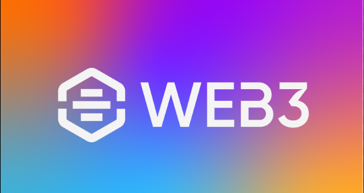

## About-me 👋
I am dedicated to becoming proficient in full-stack web development, having developed dynamic, responsive web applications to tackle complex software challenges. Through hands-on projects and competitive programming, I've honed my problem-solving skills to explore new possibilities. Looking forward to using the MERN stack and advanced tools to deliver impactful solutions in tech.

I am actively exploring the potential of Web3 technologies, which revolutionize the internet by decentralizing data and transactions, ensuring enhanced security and user autonomy. 

I have solved several problems on SPOJ to enhance my problem-solving skills and deepen my understanding of algorithms [SPOJ Profile](https://www.spoj.com/users/varun_01).

## Languages and tools

### Programming Languages
| JavaScript | C++ | C |
|:----------:|:---:|:-:|
|  | |  |

### Web Technologies
| React.js | Node.js | Express.js | HTML | CSS | Web3 |
|:--------:|:-------:|:----------:|:----:|:---:|:----:|
|||||||

### Blockchain Technologies
| IC blockchain | Motoko |
|:-------------:|:------:|
|||

### Database
| MongoDB |
|:-------:|
||

### Tools
| Git | GitHub | VS Code | @dfinity/agent | Candid UI |
|:---:|:------:|:-------:|:--------------:|:---------:|
||||||

## Important projects
Here are some of my key projects that demonstrate my skills and expertise in full-stack web development:

### DeFi Web3 App

A decentralized banking application on the IC blockchain with features such as balance management and compounding interest. Integrates HTML/CSS/JS front-end with Motoko backend, and utilizes @dfinity/agent for efficient canister interactions.
[DeFi Web3 App](https://github.com/Var2299/Web3-Decentralized-Banking)

### ChatMingle (Real-time Chat Application)

A real-time messaging application using React.js and Node.js with Socket.IO. It supports instant messaging, multi-user chat, and stores chat history in MongoDB.
[ChatMingle (Real-time Chat Application)](https://github.com/Var2299/ChatMingle-Chat-Application-)

### BooksExplorer (Books Search Application)

A book search application developed with React.js and Node.js, integrated with Google Books API for efficient information retrieval. Utilizes NLP for sentiment analysis of book descriptions, offering a responsive user interface with search functionality and pagination.
[BooksExplorer (Books Search Application)](https://github.com/Var2299/BooksExplorer-Information-Retrieval-System-)

### Weather App

It allows users to search for the weather conditions of any city in the world and provides current weather information. The app fetches weather data using the SheCodes Weather API.
[Weather App](https://github.com/Var2299/React-Weather-App)

In addition to these projects, I have worked on other interesting projects such as TODO App, QuickSign App, Simon Game, Keylogger. You can find these and more on my [GitHub profile](https://github.com/Var2299)

## Online Courses
- [The Complete 2024 Web Development Bootcamp](https://www.udemy.com/course/the-complete-web-development-bootcamp/?couponCode=THANKSLEARNER24)
- [MERN  FullStack Web Development ](https://courses.30dayscoding.com/courses/MERN-full-stack-web-development-64eebdb8e4b0a14befedc15d)
- [Mastering Data Structures & Algorithms using C and C++](https://www.udemy.com/course/datastructurescncpp/?couponCode=THANKSLEARNER24)

<!--
**Var2299/Var2299** is a ✨ _special_ ✨ repository because its `README.md` (this file) appears on your GitHub profile.

Here are some ideas to get you started:

- 🔭 I’m currently working on ...
- 🌱 I’m currently learning ...
- 👯 I’m looking to collaborate on ...
- 🤔 I’m looking for help with ...
- 💬 Ask me about ...
- 📫 How to reach me: ...
- 😄 Pronouns: ...
- ⚡ Fun fact: ...
-->
