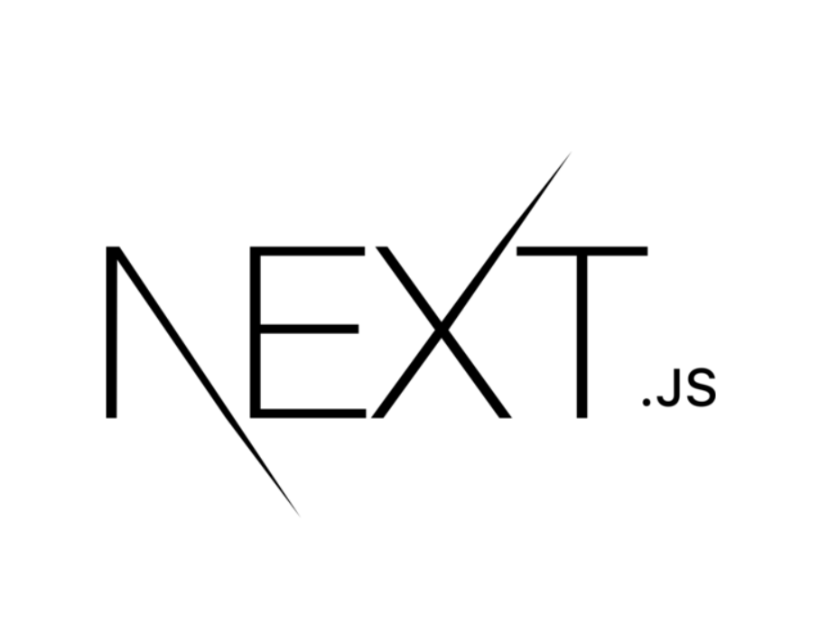
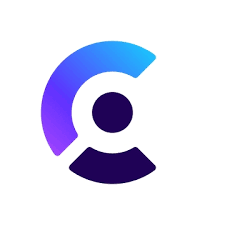

## About-me 👋
I am dedicated to becoming proficient in full-stack web development, having developed dynamic, responsive web applications to tackle complex software challenges. Looking forward to using advanced tools to deliver impactful solutions in tech.

## Languages and tools

### Programming Languages
| JavaScript | C++ | C |
|:----------:|:---:|:-:|
|  | |  |

### Web Technologies
| Next.js | React.js | Node.js | Express.js | HTML |
|:-------:|:--------:|:-------:|:----------:|:----:|
||||||

| CSS | Tailwind |
|:---:|:--------:|
|||

### Database
| MongoDB | 
|:-------:|
||

### Authentication
| Clerk |
|:-----:|
||

### Tools
| Git | GitHub | VS Code | 
|:---:|:------:|:-------:|
||||

## Important projects
Here are some of my key projects:
  
### Cashflow-Core
- [Cashflow-Core](https://github.com/Var2299/Cashflow-Core)

### Personal-Finance-Visualizer
- [Personal-Finance-Visualizer](https://github.com/Var2299/Personal-Finance-Visualizer)

## Social Media

[Linked in](https://www.linkedin.com/in/varun-singh-0a3a67175/)

## Online Courses
- [The Complete 2024 Web Development Bootcamp](https://www.udemy.com/course/the-complete-web-development-bootcamp/?couponCode=THANKSLEARNER24)
- [MERN  FullStack Web Development ](https://courses.30dayscoding.com/courses/MERN-full-stack-web-development-64eebdb8e4b0a14befedc15d)
- [Mastering Data Structures & Algorithms using C and C++](https://www.udemy.com/course/datastructurescncpp/?couponCode=THANKSLEARNER24)

<!--
**Var2299/Var2299** is a ✨ _special_ ✨ repository because its `README.md` (this file) appears on your GitHub profile.

Here are some ideas to get you started:

- 🔭 I’m currently working on ...
- 🌱 I’m currently learning ...
- 👯 I’m looking to collaborate on ...
- 🤔 I’m looking for help with ...
- 💬 Ask me about ...
- 📫 How to reach me: ...
- 😄 Pronouns: ...
- ⚡ Fun fact: ...
-->
