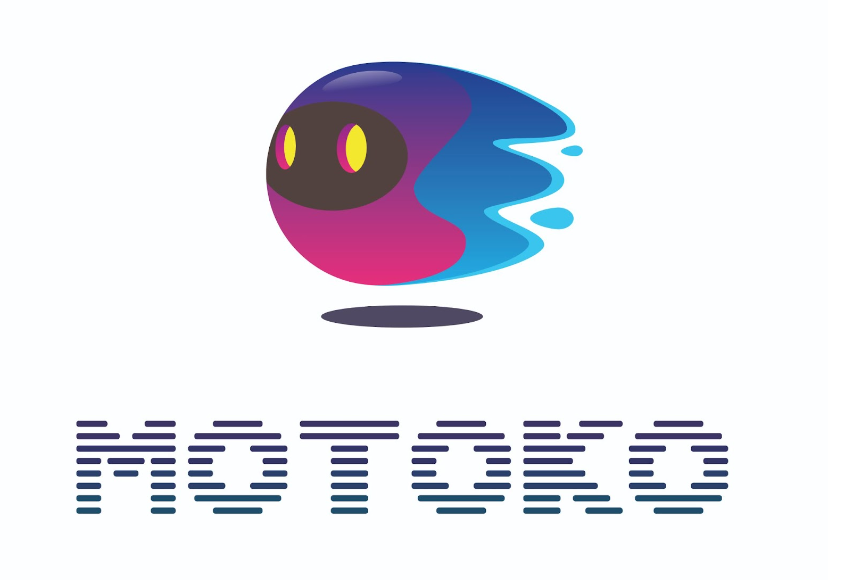
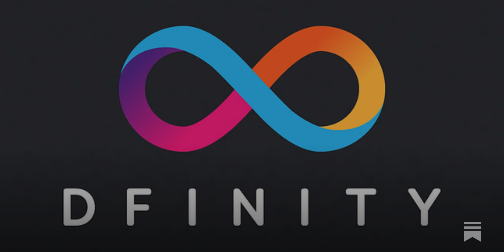
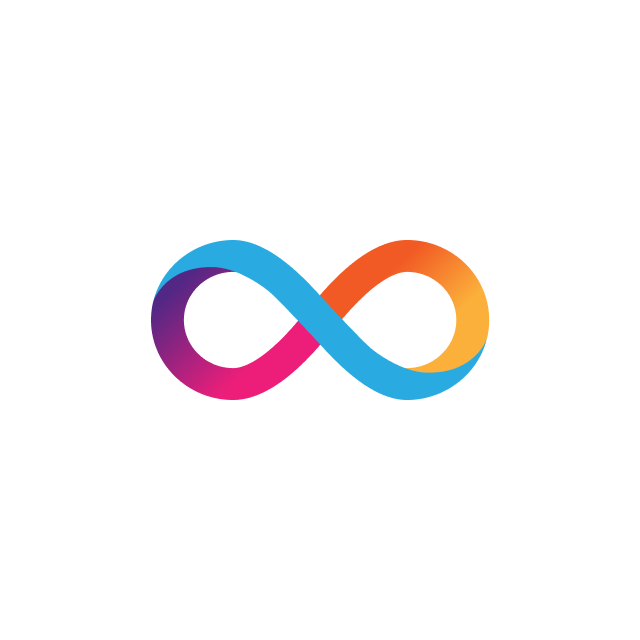

### About-me 👋
I am dedicated to becoming proficient in full-stack web development, having developed dynamic, responsive web applications to tackle complex software challenges. Through hands-on projects and competitive programming, I've honed my problem-solving skills to explore new possibilities. Eager to leverage JavaScript, React.js, Node.js, and other technologies to contribute effectively to innovative tech projects.

### Languages and tools
## Programming Languages
| JavaScript | C++ | C |
|:----------:|:---:|:-:|
|  | |  |

## Web Technologies
| React.js | Node.js | Express.js | HTML | CSS | Web3 |
|:--------:|:-------:|:----------:|:----:|:---:|:----:|
|||||-||

## Blockchain Technologies
| IC blockchain | Motoko |
|||

## Database
| MongoDB |
||

## Tools
| Git | GitHub | VS Code | @dfinity/agent | Candid UI |
||||||

<!--
**Var2299/Var2299** is a ✨ _special_ ✨ repository because its `README.md` (this file) appears on your GitHub profile.

Here are some ideas to get you started:

- 🔭 I’m currently working on ...
- 🌱 I’m currently learning ...
- 👯 I’m looking to collaborate on ...
- 🤔 I’m looking for help with ...
- 💬 Ask me about ...
- 📫 How to reach me: ...
- 😄 Pronouns: ...
- ⚡ Fun fact: ...
-->
